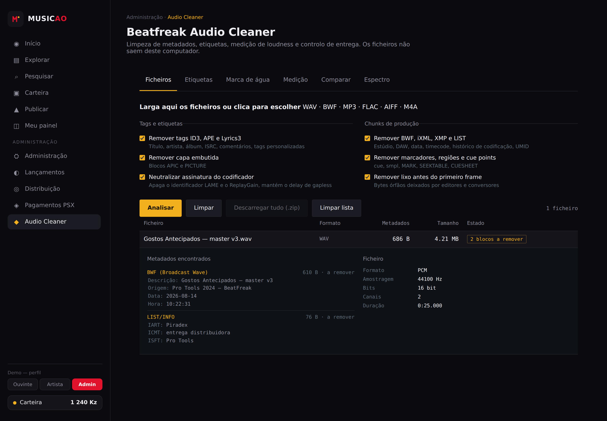
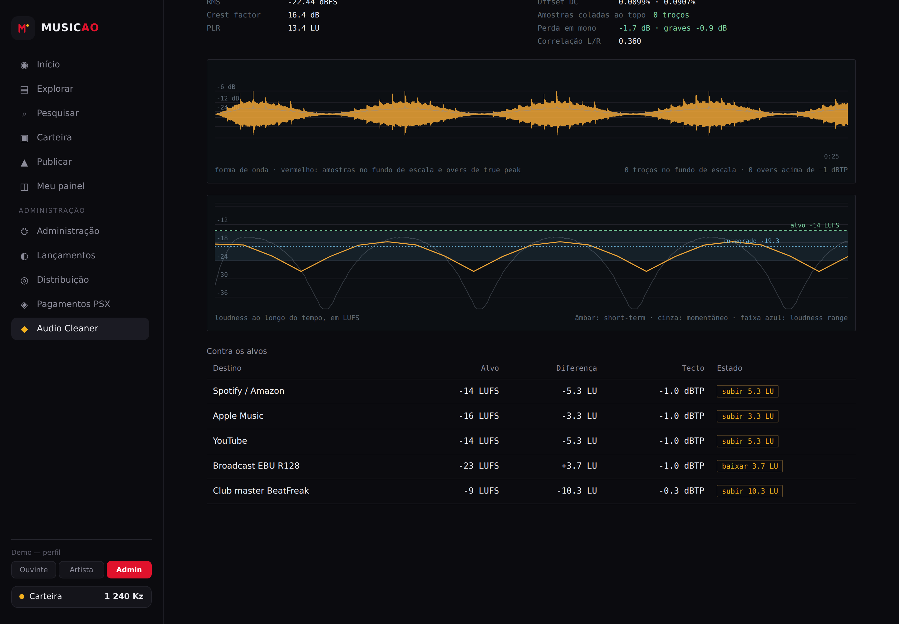
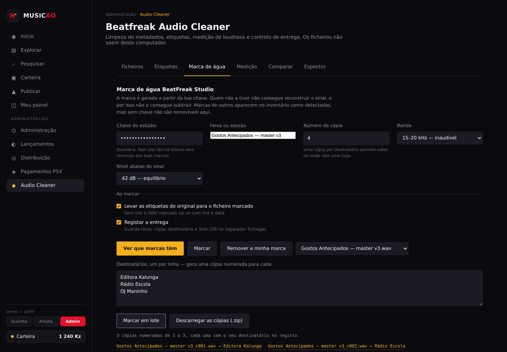
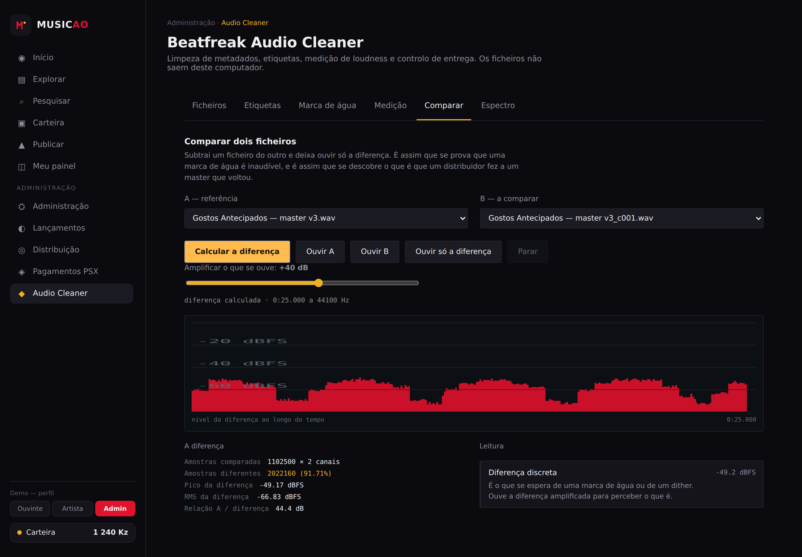

# Beatfreak Audio Cleaner

Ferramenta de estúdio para preparar masters antes da entrega: lê e apaga metadados, escreve etiquetas novas, e gere a marca de água **BeatFreak Studio** — gravar, ler e remover.

Corre inteiramente no browser. Não há servidor, não há upload, os ficheiros nunca saem do computador. O resultado é um único HTML sem dependências.

---

## O que faz

### 1. Metadados

Cada formato é desmontado bloco a bloco e reconstruído só com o que é essencial. O painel de cada ficheiro mostra o que lá estava **antes** de apagar, com o texto descodificado.

| Formato | Lê | Limpa | Escreve etiquetas |
|---|---|---|---|
| WAV / BWF | `bext`, `iXML`, XMP, `LIST/INFO`, `ID3`, `cart`, `umid`, `cue`, `smpl` | sim | `LIST/INFO` e `bext` |
| MP3 | ID3v2.2/3/4, ID3v1, ID3v1 estendido, APEv2, Lyrics3v2, Xing/LAME | sim | ID3v2.3 com capa |
| FLAC | `VORBIS_COMMENT`, `PICTURE`, `CUESHEET`, `APPLICATION`, `SEEKTABLE`, ID3 pendurado | sim | Vorbis comment com capa |
| AIFF / AIFC | `NAME`, `AUTH`, `ANNO`, `COMT`, `(c)`, `ID3`, `MARK`, `APPL` | sim | chunks de texto |
| M4A / MP4 | `udta`, `meta`, `ilst`, `uuid`/XMP | sim | ainda não |

Detalhes que fazem diferença num master:

- O cabeçalho **Xing/Info** do MP3 é mantido, senão perdes duração e seek em VBR. É a assinatura `LAME3.100` e o ReplayGain que são zerados — os bytes de delay e padding ficam intactos, para não partir o gapless.
- Em **M4A** os atoms são reescritos como `free` do mesmo tamanho, para os offsets de `stco` não deslocarem e o `mdat` ficar exactamente onde estava.
- Em **FLAC** o flag de último bloco é recalculado.
- **RF64** é detectado e recusado em vez de ser corrompido.

### 2. Verificação bit-perfect

Antes e depois da limpeza, faz SHA-256 **só do bloco de áudio** — chunk `data`, frames MPEG, frames FLAC, payload `SSND`, `mdat`. O ficheiro limpo é reanalisado do zero e os dois hashes são comparados. Se não baterem certo, o estado fica a vermelho.

### 3. Marca de água BeatFreak Studio

Espalhamento em quadratura sobre uma banda alta, com chave. Especificação completa em [`docs/WATERMARK.md`](docs/WATERMARK.md).

- **Gravar** — 128 bits com identificador da faixa, data e **número da cópia**. Uma cópia por destinatário permite saber de onde veio uma fuga.
- **Ler** — inventário de todos os ficheiros carregados: quais têm a tua marca, de que cópia, de que dia.
- **Remover** — reconstrói o mesmo sinal a partir da chave e subtrai-o. Nos testes, a recuperação é exacta: **zero amostras diferentes do original**.

A remoção é **com chave**. Sem a chave que gravou a marca, o sinal não pode ser reconstruído, e portanto não pode ser subtraído. Marcas de terceiros aparecem no inventário como anomalias detectadas, mas não são removíveis aqui.

### 4. Controlo de entrega

Loudness por **ITU-R BS.1770-4 / EBU R128**: integrado com duplo gate, short-term e momentâneo máximos, e loudness range pelos percentis 10–95. Verificado contra o caso de referência da EBU Tech 3341 — um seno de 1 kHz com pico a −23 dBFS lê −22,99 LUFS.

**True peak** com sobreamostragem de 4× por filtro polifásico, com interpolação só à volta dos picos para não arrastar o ficheiro todo. Comparação automática contra os alvos do Spotify, Apple Music, YouTube, EBU R128 e o club master a −9 LUFS, com o que falta subir ou baixar em cada um.

E as leituras que dizem o que é que o ficheiro é mesmo, por baixo do que o cabeçalho declara:

- **Profundidade real** — um ficheiro que diz 24 bit mas tem os 8 bits de baixo sempre a zero é um 16 bit com enchimento. Apanha quem te manda falso 24 bit.
- **Origem em codec com perdas** — um "WAV" que na verdade saiu de um MP3 descodificado. O corte a pique no espectro e a inclinação logo acima dele dão a estimativa do codec e do débito.
- **Compatibilidade mono** — quanta energia se perde ao somar para mono, e quanto disso são graves abaixo de 120 Hz. Rádio e coluna de telemóvel vivem em mono.
- Amostras consecutivas coladas ao fundo de escala, offset DC, crest factor, PLR, ruído de fundo, e silêncio à cabeça e à cauda em amostras.

### 5. Registo de entregas

Um número de cópia só serve para alguma coisa se souberes a quem foi entregue. Cada cópia marcada fica registada com faixa, número, destinatário, data, ficheiro e SHA-256 do que saiu, com exportação para CSV e JSON.

A **marcação em lote** recebe uma lista de destinatários, um por linha, e gera as cópias todas numeradas de seguida, com download individual e um zip de todas. As etiquetas do original são levadas para cada cópia, para o ficheiro entregue não sair despido.

O registo fica no `localStorage` deste browser. Exporta de vez em quando.

### 6. Comparar dois ficheiros — null test audível

Subtrai um ficheiro do outro e deixa **ouvir só a diferença**, com um ganho até +70 dB. É a prova mais directa de que a marca de água é inaudível: com o master original em A e a cópia marcada em B, ouve-se apenas o sinal acrescentado, e o painel diz a que nível está.

Serve para mais do que isso — pões o teu master em A e a versão que voltou do distribuidor em B, e vês o que é que eles lhe fizeram. Nos testes, original contra cópia marcada dá pico a −45 dBFS e 41,7 dB abaixo do programa; original contra cópia desmarcada dá **silêncio absoluto**.

### 7. Gráficos

**Forma de onda anotada** — envelope de picos com o RMS por cima, troços colados ao fundo de escala a vermelho, marcas dos overs de true peak acima do tecto, e o silêncio da cabeça e da cauda sombreado.

**Curva de loudness** — short-term e momentâneo ao longo da faixa, com a linha do alvo escolhido, o integrado, e o loudness range desenhado como faixa entre os percentis. Vê-se logo onde é que a faixa foge.

**Nível da diferença** no null test, em dBFS ao longo do tempo.

### 8. Análise espectral

Diagnóstico, para perceber o que é que um distribuidor ou uma plataforma acrescentou a um master: corte espectral (denuncia passagem por codec com perdas), entalhes estreitos persistentes, subida anómala de energia acima de 19 kHz, ciclos repetidos na banda alta por autocorrelação do envelope, e conteúdo escondido no canal lateral L−R.

---

## Dentro da Music AO



O Cleaner como rota `#/cleaner`, com a sidebar e o selector de perfil da Music AO à volta. Os metadados do master aparecem antes de serem apagados — o `bext` com o nome do estúdio e da DAW, o `LIST/INFO` com o artista e o comentário de entrega.



Forma de onda anotada, curva de loudness com o alvo e a comparação contra as plataformas.



Três cópias numeradas, uma por destinatário, cada uma com o seu link. *(O separador da marca de água está visível nesta demonstração; na integração fica escondido por omissão — ver a nota sobre a chave mais abaixo.)*



O master original contra a cópia marcada: a diferença fica a −49 dBFS de pico, 44 dB abaixo do programa.

### Como instalar

O Cleaner também corre embebido, como uma rota da [Music AO](docs/INTEGRACAO-MUSICAO.md). Todo o CSS fica isolado dentro de `.bfac` e todos os ids levam o prefixo `bfac-`, por isso não colide com a sidebar, com o `#walletChip` nem com nenhuma classe existente.

```bash
python3 tools/embed.py                                  # gera dist/musicao/
python3 tools/integrar_musicao.py ../musicao-app        # instala (--simular para ver primeiro)
```

Há uma demonstração pronta em `dist/musicao/exemplo.html` — abre-a com duplo clique e carrega em *Ficheiros* com um master teu, ou chama `carregarExemplo(25)` na consola para gerar um de teste.

O script acrescenta o item de menu com `data-role="admin"`, a rota `#/cleaner`, o `<script>` e o `<link>`, faz cópia de segurança de cada ficheiro e recusa-se a avançar se não reconhecer os pontos de inserção.

**A chave da marca de água nunca pode ir para o código da Music AO.** Tudo o que chega ao browser é público, e uma chave exposta deixa qualquer pessoa ler e remover as marcas de todas as entregas. Por isso a integração esconde o separador da marca de água por omissão — o `data-role="admin"` do protótipo é um selector de demonstração, não autenticação.

### Validar uploads de artistas

É onde isto rende mais para a plataforma. No fluxo de publicação:

```js
const v = await BeatfreakCleaner.validar(bytes, ficheiro.name, null, { audioBuffer: buf });
if (!v.ok) mostrarErros(v.motivos.filter(m => m.nivel === 'rejeitado'));
```

Recusa formato com perdas no catálogo, menos de 16 bit reais, **24 bit com enchimento**, true peak acima de −1 dBTP, faixas curtas demais e **master com perdas disfarçado de WAV**. Avisa sobre loudness fora de −20 a −6 LUFS, clipping, silêncio à cabeça e graves que somem em mono. Os motivos vêm escritos em português, prontos a mostrar ao artista. Correr isto no browser poupa a largura de banda de um upload que ia ser recusado — em Luanda isso conta.

## Usar

**Publicado:** activa o GitHub Pages em *Settings → Pages → Source: GitHub Actions*. O workflow `pages.yml` gera e publica a cada push para `main`.

**Local:** abre `dist/index.html` com duplo clique. Não precisa de servidor.

```bash
python3 tools/build.py     # gera dist/index.html
```

---

## Limites, ditos com clareza

**A marca de água aguenta:** remoção de metadados, mudança de contentor, redução de profundidade de bits, alterações de ganho, ruído adicionado até cerca de −70 dBFS.

**A marca de água não aguenta:** codificação com perdas (o MP3 deita fora a banda dos 15–20 kHz), reamostragem, filtragem pesada, ou corte no início do ficheiro. A leitura precisa de alinhamento à amostra a partir do início — se cortares o começo, a marca deixa de ser legível. Está desenhada para entregas **lossless**: o WAV que sai do estúdio para o distribuidor ou para o cliente.

Números medidos em `test/robustness.test.mjs`:

| Alteração | Banda 15–20 kHz | Banda 4–9 kHz |
|---|---|---|
| nenhuma | lida, margem 18 dB | lida, margem 19 dB |
| ganho −6 dB | lida | lida |
| ganho −1,4 dB | lida | lida |
| ruído a −70 dBFS | lida | lida |
| passa-baixo 16 kHz | perdida | perdida |

**A remoção é exacta só no ficheiro marcado tal e qual.** Se o ficheiro foi alterado depois de marcado (ganho, EQ, conversão), a marca ainda se lê mas a subtracção deixa um resíduo, porque a amplitude reconstruída já não corresponde.

**Guarda a chave.** Não está gravada em lado nenhum. Sem ela não consegues ler nem remover as tuas próprias marcas.

**O registo vive no browser.** Limpar os dados do site apaga-o. Exporta para CSV depois de cada lote de entregas.

---

## O que este projecto não faz

Não remove marcas de água de terceiros. O removedor é com chave por desenho, não por omissão: só consegue subtrair um sinal que consiga reconstruir, e só reconstrói com a chave de quem o gravou.

Um removedor genérico serviria sobretudo para lavar promos e cópias de trabalho alheias antes de as pôr a circular. Não é para isso que isto existe, e não vai ser acrescentado.

O detector é outra coisa: perceber que uma cópia tua traz uma marca que não puseste é informação tua, e está disponível.

---

## Desenvolvimento

```
src/
  index.html          markup e separadores
  css/app.css
  js/
    util.js           SHA-256 em JS puro, CRC32, ZIP store, formatação
    formats.js        analisadores WAV, MP3, FLAC, AIFF, M4A
    pcm.js            leitura/escrita PCM sem perder a profundidade de bits
    dsp.js            FFT, espectrograma, relatório de anomalias
    measure.js        filtro K, LUFS, LRA, true peak, diagnóstico do ficheiro
    draw.js           forma de onda anotada, curva de loudness, nível da diferença
    watermark.js      marca BFS-1: gravar, ler, remover
    tags.js           escrita de ID3v2.3, Vorbis, LIST/INFO, bext, AIFF
    register.js       registo de entregas em localStorage
    validate.js       veredicto de upload para a Music AO
    app.js            interface
tools/
  bundle.py           junta os módulos pela ordem certa
  build.py            gera dist/index.html
  embed.py            gera dist/musicao/ com CSS e ids isolados
  screenshots.py      capturas da demonstração para o README
  integrar_musicao.py instala o módulo numa cópia da Music AO
  make_fixtures.py    gera ficheiros de teste com metadados realistas
test/                 testes em node
docs/WATERMARK.md     especificação da marca
docs/INTEGRACAO-MUSICAO.md   como encaixar na plataforma
```

Os módulos são scripts clássicos concatenados por ordem, sem passo de compilação e sem `import`. É de propósito: o resultado tem de ser um ficheiro que abre com duplo clique daqui a cinco anos.

```bash
npm install                        # só jsdom, para os testes
python3 tools/make_fixtures.py
npm test
```

Os testes cobrem: ida e volta dos cinco formatos com verificação de hash do áudio, o caso de referência da EBU Tech 3341 para o LUFS, true peak entre amostras, detecção de profundidade falsa, gravação e leitura da marca, exactidão da remoção amostra a amostra, rejeição com chave errada, robustez a ganho e ruído, o fluxo completo em jsdom — medição, marcação em lote de três cópias, leitura de cada número de volta e escrita no registo — e o null test, que confirma que original contra desmarcado dá zero amostras diferentes.

---

## Licença

MIT. Ver [LICENSE](LICENSE).
